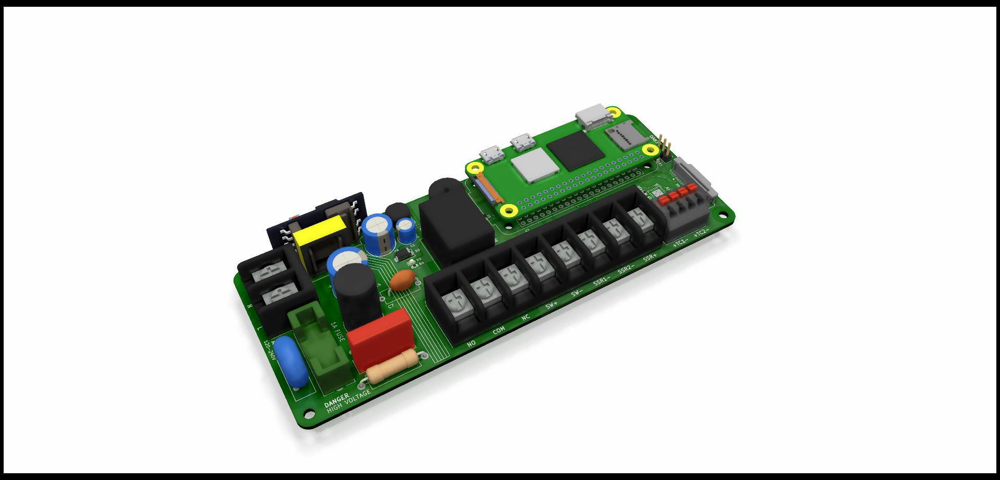

# MLL Electronics Oven Controller v1.0

A Raspberry Pi Zero-powered PID reflow oven controller -- PCB design files.

## Controller PCBA

## License

This project is licensed under the CERN-OHL-W v2. See LICENSE for more details.
